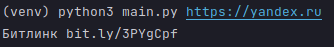

# Short_urls
Short urls from console

# Information
If you enter short url in console, you will get number of clicks on the link:


If you enter long url in console, you will get a short link of this link:



# Install
First of all, install packages from **_requirements.txt_**:

```python pip -m install -r requirements.txt```

# Run
Open console and run python file **_main.py_**:

```python main.py https://yandex.ru```
or 
```python main.py bit.ly/3PYgCpf```

# Errors
If something wrong, you will see error in console: (example)

